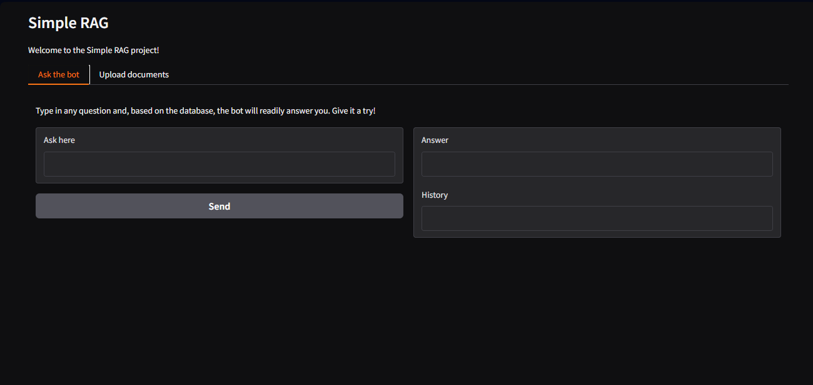
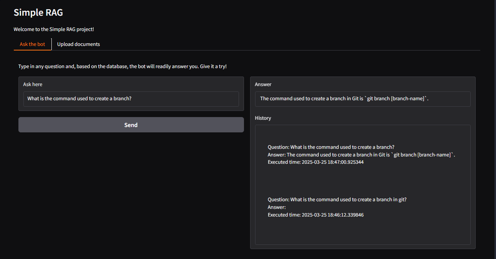
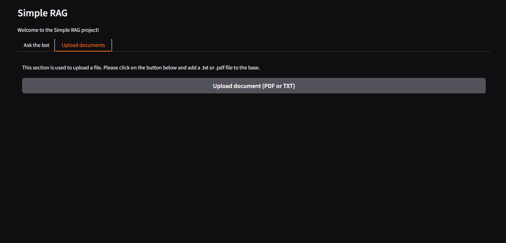

# Simple RAG Project

This project is a basic application of a Retrieval-Augmented Generation (RAG) with simple data management.

### Features

This RAG app was created to run without relying on GPU. It's slower, but more suitable to lower end devices. It was built using Langchain and HuggingFace models (`sentence-transformers/all-MiniLM-L6-v2` for the embeddings, and `Qwen/Qwen2.5-1.5B` for generating responses), and the app interface was created using Gradio.

The app also contains a simple data updater, which regenerates vector data every time the source data (documents) has any change or when the app starts.

### Layout

The app layout contains two tabs: the first one, where you ask the bot; and the second one, where you can upload documents to add more information to the source.

The "Ask the bot" tab contains a simple input field, where you type your question, an answer field where the bot response is displayed.

When the bot generates a response, it shows up in the answer field, and a basic history which preserves some answers starts being filled. The history is erased when the app finishes running.

The "Upload documents" tab is even simpler: all it has is a button, which should be clicked to update files.

### Known limitations and issues

As stated before, this app is slow as it doesn't use GPU for speeding up the language models. Also, it lacks some security measures regarding data management which are expected to be fixed in later versions.

### Next steps

The most immediate improvements are the data management system and the security measures. 
